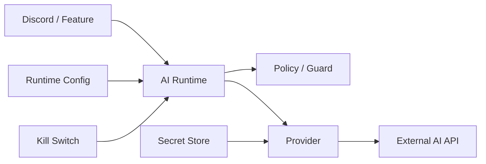

個人開発のDiscord Botに生成AIを入れ始めたとき、最初は単純でした。

1. API Keyを読む
2. Provider APIを呼ぶ
3. 返ってきた文章をDiscordへ返す

小さく試すだけなら、これで十分です。

ただ、実際に運用する前提になると、API呼び出しそのものより周囲の設計が気になってきました。

- API Keyとmodel設定を同じ場所に保存してよいのか
- Secret Storeが壊れたとき、古い環境変数へfallbackしてよいのか
- Rate Limitだけで利用料金を守れるのか
- Provider障害時にAIだけすぐ止められるか
- Providerのエラー本文をそのまま外へ出してよいのか

そこで、アプリケーションと外部AI Providerの間に小さな **AI Runtime** を置く形にしました。

この記事では、実装して特に重要だった4つの境界だけに絞ります。

> 現時点で実装済みのProviderはOpenAIのみです。ClaudeやGeminiへの対応方法ではなく、Providerが1つの段階でも先に分離しておくと扱いやすかった部分をまとめています。

## 全体像



Feature側からProvider SDKを直接呼ばず、必ずRuntimeを通します。

Runtimeが担当するのは主に次の部分です。

- Credentialの解決
- modelなどのRuntime Config
- Rate Limit / Quota / Cost / Concurrency
- Kill Switch
- Errorの分類

Provider固有のrequest bodyやresponse parsingはProvider実装側へ閉じ込めます。

## 1. Secretと通常設定を分ける

API Keyとmodel名は、どちらも「設定」に見えます。

ただ、必要な扱いはかなり違いました。

| 種類 | 例 | 管理 |
| --- | --- | --- |
| Secret | API Key | encrypted Secret Store |
| Runtime Config | model / reasoning | typed non-secret store |
| Security Gate | enable / kill switch | server-side config |

modelやreasoningは管理画面から変更したい一方、API Keyは通常の設定APIやPlugin configへ混ぜたくありません。

このため、**Secret・変更可能な設定・Security Gateを別物として扱う**ようにしました。

Runtime Configも任意文字列をそのまま受け取らず、server側のallowlistを通します。保存済みの値が不正でも、近いmodelへ勝手に丸めない方針です。

### Secret Store障害時はfail closed

移行期間中は、Secret StoreにKeyが未登録なら従来の環境変数を見るfallbackを残しています。

ただし、次の2ケースは分けました。

1. Secret Storeを正常に読めたが、Keyが未登録
2. DB障害やdecrypt失敗で、Secret Storeを正常に読めない

1ではenv fallbackを許可し、2では許可しません。

```ts
async function resolveCredential(): Promise<string | null> {
  try {
    const stored = await readSecret();
    if (stored) return stored;
  } catch {
    // Secretが「無い」のではなく、安全に確認できない
    return null;
  }

  return process.env.PROVIDER_API_KEY?.trim() || null;
}
```

障害時にもenvへ逃がすと、管理上はSecretを止めたつもりでも、古いCredentialで外部callが続く可能性があります。

Credential周りでは、可用性より「意図しない継続をしない」方を優先しました。

## 2. Rate Limitと予算管理を分ける

Rate Limitは必要ですが、それだけでは利用料金を守れません。

例えば10回のrequestでも、軽いmodelと高価なmodelではCostが違います。

そのためRuntimeでは、次を別々に扱っています。

- per-user Rate Limit
- scope単位のRate Limit
- Cost Budget
- 1 requestあたりのCost Cap
- global concurrency

考え方はシンプルで、

**回数・金額・同時実行数は別の制約**

として見ることです。

CostはProvider call前に安全側で予約し、完了後にProviderが返したusageで精算します。

これなら「回数制限には余裕があるが、今日のBudgetを超えたので停止する」といった判断をRuntime側でできます。

## 3. Kill SwitchでAIだけ止められるようにする

外部AIはアプリ本体とは別の障害要因を持ちます。

- Provider障害
- 想定外の課金
- abuse
- Credential問題

このため、通常の有効・無効設定とは別にKill Switchを置きました。

重要なのは、**AIを停止してもBot本体は起動できる**ことです。

AI機能をoptional subsystemとして扱えば、Providerが使えないだけでReminderやPollなど別機能まで停止するのを避けられます。

自分の構成では、AI disabled時にはCredentialの読み込み自体を行わないケースもテストで固定しています。

## 4. Providerの生エラーをアプリ側へ広げない

ProviderごとにHTTP statusやerror JSONは異なります。

Feature側がそれらを直接扱い始めると、Provider依存がアプリ全体へ広がります。

そこでRuntimeから外へ出す失敗は、例えば次のようなcategoryへ寄せています。

- `disabled`
- `rate_limited`
- `quota_exceeded`
- `timeout`
- `provider_unavailable`
- `provider_rejected`
- `malformed_response`
- `internal_error`

Providerの生のerror bodyは、そのまま利用者向けresponseやstructured logへ流しません。

Observabilityも同じ考え方です。raw prompt / raw responseを通常telemetryへ保存せず、基本はmetadataを残します。

- provider / model
- latency
- token usage
- estimated cost
- result / error category

これだけでも、Cost増加や失敗率の変化はかなり追えます。

## Providerが1つなら、抽象化しすぎない

ここまで分離すると、OpenAI / Claude / Gemini共通の巨大なInterfaceを先に作りたくなります。

自分はそこまではやっていません。

今共通化しているのは、すでに共通だと分かっているRuntime側の境界です。

- Policyを通す
- Credentialを安全に解決する
- Cost / Rate / Concurrencyを守る
- 分類済みの結果を返す

一方で、Provider固有のrequest schema、reasoning指定、streaming、tool callingなどは無理に共通化していません。

2つ目のProviderを実装したときに、本当に共通している部分を見てAdapterを固める方が安全だと考えています。

## 実装するときのチェックリスト

AI機能を運用へ持っていくときは、Provider SDKを選ぶ前後で次を確認すると整理しやすいです。

- [ ] Secretと通常設定を分離している
- [ ] Secret Storeの「未登録」と「障害」を区別している
- [ ] Rate Limitとは別にCost上限がある
- [ ] AIだけ停止できるKill Switchがある
- [ ] Providerの生エラーを外へ出していない
- [ ] raw prompt / responseを無条件に保存していない
- [ ] Provider固有処理がFeature側へ漏れていない

## まとめ

生成AIをアプリへ組み込むとき、Provider APIを呼ぶ部分自体はそこまで難しくありませんでした。

運用で効いてきたのは、その前後にある境界です。

特に自分の環境では、

**Secret / Config / Cost / Failureを分けてからProviderを呼ぶ**

という形にしたことで、AI機能をアプリ本体から独立して扱いやすくなりました。

Providerが1つしかない段階でもSecurityやCostの境界は先に共通化し、Provider差分の抽象化は実装が増えてから考える。この順番が、今のところ一番扱いやすいと感じています。
