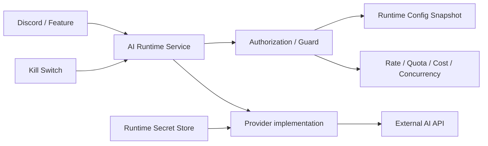

# 生成AIを「APIを呼ぶだけ」で終わらせない — Secret・Quota・Kill Switchを分離したAI Runtime設計

Discord Botに生成AIを入れ始めたとき、最初に必要だったのはそこまで複雑なものではありませんでした。

API Keyを環境変数から読み、ProviderのAPIを呼び、返ってきた文章をDiscordへ返す。小さく始めるなら、それで十分です。

ただ、実際に運用する前提で作り始めると、APIを呼ぶ部分より周囲の方が気になってきました。

- API Keyはどこで管理するのか
- modelやreasoning設定を変えるたびに再deployするのか
- 設定DBが壊れたとき、古いenvへ勝手にfallbackしてよいのか
- 1ユーザーが連打したらどうするのか
- Guild単位の予算上限をどう持つのか
- Provider障害や想定外の課金が起きたとき、AI機能だけ即座に止められるか
- Providerの生のエラー本文をそのまま利用者やlogへ流してよいのか

このあたりを一つずつ足していくと、「OpenAI APIを呼ぶ処理」ではなく、アプリケーションと外部AI Providerの間に独立したRuntime境界が必要になりました。

今回は、個人開発しているBotで実際に作ったAI Foundationを元に、Secret、Runtime Config、Quota、Kill Switch、Error handlingをどこで分けたかを書きます。

なお、現時点で実装済みのProviderはOpenAIだけです。ClaudeやGeminiまで対応済みという話ではありません。むしろ、Providerが1つの段階でどこまで共通境界を作り、どこから先はProvider固有として残したか、という設計の話です。

## Provider SDKを直接アプリケーションへ広げない

最初に決めたのは、Discordのcommandや各PluginからProvider SDKを直接呼ばないことでした。

大まかな依存関係は次のようにしています。



Feature側が知るのは「生成を依頼すると、成功結果か分類済みの失敗が返る」という境界までです。

Providerのrequest body、timeout処理、response parsing、usageの読み方などはProvider実装側へ閉じ込めます。

この構成にした一番の理由は、将来Providerを増やしたいから、だけではありません。Rate LimitやQuota、Privacy、Kill Switchといった**Providerに関係なく守りたいルールを、一か所で通すため**です。

## SecretとRuntime Configを同じものとして扱わない

途中でかなり重要だと感じたのが、API Keyとmodel設定を同じ「設定」として保存しないことでした。

自分の構成では、次のように分けています。

| 種類 | 例 | 管理 |
| --- | --- | --- |
| Secret | API Key | encrypted Runtime Secret Store |
| Runtime Config | provider / model profile / reasoning | typed non-secret store |
| Security Gate | AI enabled / kill switch / quota上限 | server-side config |

modelやreasoningは管理画面から変えたい。一方でAPI Keyは通常の設定APIやPlugin configへ混ぜたくない。

この2つを分離すると、管理画面の権限や監査対象も整理しやすくなりました。

また、Runtime Config側は任意の文字列をそのまま受け取らず、server側のallowlistをSource of Truthにしています。保存済みの値が不正だった場合も「近そうなmodelへ勝手に丸める」のではなく、unsupported combinationとして扱います。

便利さより、何を実行したのか後から説明できることを優先しました。

## Secret Store障害時は、envへ逃がさない

Secret移行時に迷ったのがfallbackです。

移行期間だけを考えるなら、Runtime Secret StoreにAPI Keyがなければ従来の環境変数を見る、というのは便利です。

ただし次の2つは分ける必要があります。

1. Secret Storeを正常に読めたが、まだSecretが登録されていない
2. DB障害やmaster key不整合などで、Secret Storeを正常に読めなかった

自分の実装では、1のときだけlegacy envへfallbackし、2はfail closedにしています。

簡略化するとこういう形です。

```ts
async function resolveCredential(): Promise<string | null> {
  try {
    const stored = await readSecret();

    if (stored) {
      return stored;
    }
  } catch {
    // 「Secretが無い」のではなく「安全に確認できない」
    return null;
  }

  return process.env.PROVIDER_API_KEY?.trim() || null;
}
```

ここで障害時にもenv fallbackすると、「管理画面上ではSecretを無効化したつもりなのに、古い環境変数でProvider callが継続する」という状態を作れます。

テストでも、Secret Storeのdecrypt失敗やDB read失敗時にはenvへfallbackしないケースを固定しています。

この設計は可用性を少し犠牲にしますが、CredentialのようなSecurity境界ではこちらを選びました。

## Runtime Configはrequest開始時にsnapshot化する

model設定を管理画面から変更できるようにすると、今度は「実行途中で設定が変わったらどうするか」が出てきます。

自分の実装では、request開始時にprovider / model / reasoning / pricing情報を解決し、そのrequest内ではimmutableなsnapshotとして扱います。

複数instanceで毎回DBを引くのも避けたかったため、resolverには短いTTLを持たせています。ただし、一つのrequestの途中で設定を再取得することはしません。

これは細かい話に見えますが、Cost Guardまで入れると重要でした。

たとえばrequest開始時はModel Aの価格でpreflightしたのに、Provider call直前だけModel Bへ切り替わると、予約したCostと実際のCostの前提がずれます。

「設定変更を即時反映する」より、「1 requestの中では前提を固定する」を優先しています。

## Rate Limitだけでは予算を守れなかった

生成AIを組み込むとき、最初はRate Limitだけでも十分そうに見えました。

しかし、Rate Limitは「何回呼べるか」は制限できますが、「いくら使えるか」は直接制限できません。

そこでRuntime側では、少なくとも次を別々のGuardとして扱っています。

- per-user Rate Limit
- per-scope Rate Limit
- scope単位のCost Budget
- 1 requestあたりのpreflight Cost Cap
- global concurrency

CostはProvider call前に保守的に予約し、完了後にProviderが返したauthoritative usageでsettleする形にしています。

ここで重視したのは、平均的な入力を前提に安く見積もらないことです。入力上限まで来てもGuardの想定内に収まるよう、preflightでは安全側に寄せます。

Rate Limit、Quota、Concurrencyを一つの巨大な条件分岐にせず、それぞれ別の責務として置いたことで、後から「回数は許可するが予算で止める」「予算は残っているが同時実行数で待たせる」といった状態を追いやすくなりました。

## Kill Switchは管理画面の便利設定にしなかった

AI Runtimeには、機能の有効・無効とは別にKill Switchを置いています。

Provider障害、予算異常、abuse疑いなど、原因調査より先に外部callを止めたい場面を想定したものです。

ここは通常のRuntime Configと同じ扱いにはしていません。

管理画面でmodelを変えられることと、緊急停止用のSecurity Gateを書き換えられることは別問題だからです。

また、AI機能がdisabledでもBot本体は起動できるようにしています。AIのCredentialがない、Providerが使えない、Kill SwitchがON、といった理由で非AI機能まで巻き込んで停止しないためです。

この「AIはoptional subsystem」という扱いは、実装してみてかなり重要でした。

## Providerのエラー本文をそのまま外へ出さない

外部APIの失敗は種類が多く、Providerごとにresponse bodyも違います。

一方、Feature側がProvider固有のHTTP statusやerror JSONを知り始めると、境界を作った意味が薄くなります。

そこで外へ出す失敗は、Runtime側でcategoryへ寄せています。

例としては次のようなものです。

- `disabled`
- `unauthorized`
- `rate_limited`
- `quota_exceeded`
- `invalid_input`
- `timeout`
- `provider_unavailable`
- `provider_rejected`
- `malformed_response`
- `output_too_large`
- `internal_error`

Providerの生のerror bodyを、そのまま利用者向けresponseやstructured logへ流しません。

これはProvider差分を吸収するためだけでなく、予期しない内部情報やrequest断片をlogへ残さないためでもあります。

## Observabilityは欲しい。でもprompt本文は要らない

AI機能は、何も記録しないと障害調査やCost分析がかなり難しくなります。

一方で、raw prompt / raw responseを全部保存する設計にもしたくありませんでした。

そこで通常のtelemetryでは、本文ではなくmetadataを中心に残す方針にしています。

- request ID
- feature
- provider / model
- latency
- input / output token usage
- estimated cost
- result / error category

これなら「どのmodelで失敗率が上がったか」「Costが急に増えていないか」は見られます。

prompt本文が本当に必要なdebug機能を将来作るとしても、通常telemetryとは別の明示的な仕組みにした方が扱いやすいと考えています。

## Providerが1つなのに、抽象化しすぎない

ここまで書くと、最初からOpenAI / Claude / Gemini共通の巨大なProvider Interfaceを作りたくなります。

自分はそこまではやっていません。

現時点で実装済みなのはOpenAIだけなので、まだ分からない差分を想像して共通型へ押し込むと、抽象化の方が先行します。

今の段階で共通化しているのは、アプリケーション側が必要とするRuntimeの境界です。

- bounded inputを受ける
- server-side policyを通す
- request単位のruntime snapshotを使う
- 成功結果か分類済みerrorを返す
- telemetry metadataを送る

逆に、Provider固有のrequest schema、reasoning指定、stream event、tool calling、usageの詳細まで無理に共通化していません。

ClaudeやGeminiを追加するときは、2つ目・3つ目の実装で本当に共通している部分を見てからAdapter境界を固める予定です。

「将来差し替えたいから全部interface化する」ではなく、**今すでに守る必要があるPolicy境界を先に共通化する**、という順番にしています。

## テストで固定したかったのは「成功すること」より失敗時の挙動

AI連携のテストというと、正常なProvider responseをmockして文章が返ることを確認しがちです。

それも必要ですが、今回優先したのは次のようなケースでした。

- Secret Storeの値をlegacy envより優先する
- Secret未登録時だけenv fallbackする
- decrypt / DB障害時はfail closedする
- AI disabled時はCredentialを読まない
- Credentialが成立した場合だけRuntime Serviceを構築する
- 不正なRuntime Configを任意のmodelへsilent downgradeしない

外部Providerとの境界は、正常時より「異常時に何をしないか」をテストへ残した方が、後の変更でSecurity Policyを壊しにくいと感じています。

## 今のところの結論

生成AI機能を追加していて、一番設計量が増えたのはPromptでもProvider APIの呼び方でもありませんでした。

Secret、設定変更、Rate / Quota / Cost、停止手段、Error、Privacyをどう境界化するかの方でした。

個人開発なので、最初から大規模Platformのような仕組みを作る必要はありません。ただ、外部AI APIはCredentialと従量課金を持つため、普通の外部APIより「止められること」「使いすぎないこと」「失敗時に安全側へ倒れること」を早めに決めておく価値がありました。

現在はOpenAIのみですが、次に別Providerを追加するときも、まず守りたいのは共通Provider Interfaceの美しさではなく、このRuntime境界です。

Providerが増えた結果、本当に共通だったものと固有だったものが見えてきた段階で、抽象化も更新していくつもりです。
