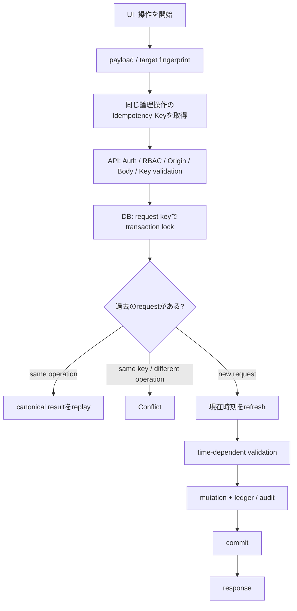

管理画面で「公開」を押した。

少し待った。

そして、エラーが出た。

ここまでは、よくある話です。

困ったのは、その次でした。

**公開に失敗したのか。公開には成功したけれど、responseだけ届かなかったのか。分からない。**

画面から見えるのは「失敗」の2文字だけです。

でも、serverの向こうではすでにDBへcommitされているかもしれない。

もう一度押していいのか。

押したら二重実行にならないか。

押さなかったら、実は何も起きていないのではないか。

作っていたのは、ごく普通の管理機能でした。

Draftを作る。公開する。必要なら取り消す。

最初は、APIを作ってボタンからPOSTできれば終わると思っていました。

終わりませんでした。

この記事では、その「成功したか分からない」をどう扱ったかを書きます。

テーマは `Idempotency-Key` です。

ただし、headerにUUIDを1個付ける話ではありません。

最終的には、

```text
UI
 ↓
API
 ↓
DB
```

の3層すべてで、**「これは同じ操作なのか？」**を共有する設計になりました。

前半はIdempotencyを初めて実装する人向けに、後半はconcurrencyや時刻境界まで踏み込みます。

## 「失敗」なら、まだ簡単だった

例えば入力値が間違っていて、APIからこう返ってきたとします。

```http
HTTP/1.1 400 Bad Request
```

これは比較的分かりやすい失敗です。

serverがrequestを受け取り、「この入力では処理しない」と答えています。

直してから、もう一度送ればいい。

認証が切れて401になった。
権限がなく403になった。
対象が見つからなくて404になった。

アプリ側で結果を確定的に解釈できるなら、次の行動を決めやすいです。

厄介なのは、こういうときです。

```text
Browser
  │
  │ POST /publish
  ▼
API
  │
  ▼
Database
  │ COMMIT
  ▼
成功
  │
  │ response
  X  ← network error
Browser
```

DBでは成功している。

でもBrowserはresponseを受け取っていない。

Browserから見れば失敗です。

この状態を、この記事では **ambiguous failure（結果が曖昧な失敗）** と呼びます。

HTTPの仕様でも、通信障害後にrequestを自動retryできるかは、その操作がidempotentかどうかと深く関係します。RFC 9110ではPUTやDELETEなどはidempotentと定義されていますが、POSTはそれだけでは同じ保証を持ちません。

つまりPOSTを安全にretryしたいなら、**アプリケーション側で「同じ操作を繰り返しても、意図した効果は1回分にする」仕組みを作る必要があります。**

## Idempotencyを一言でいうと

Idempotencyという言葉は少し難しく見えます。

この話では、まずこう考えると分かりやすいです。

> 同じ「論理的な操作」を何度送っても、利用者から見た効果を1回分にする。

例えば「お知らせを1件作る」という操作なら、network retryが3回発生しても、お知らせが3件増えてはいけません。

```text
1回目 → 作成成功、response紛失
2回目 → 1回目の結果を返す
3回目 → 1回目の結果を返す
```

これならBrowserは安心してretryできます。

そこで、最初に思いつくのが `Idempotency-Key` です。

```http
POST /notices
Idempotency-Key: 550e8400-e29b-41d4-a716-446655440000
Content-Type: application/json
```

serverはこのkeyを見て、

> この操作、前にも見た？

を判断します。

ここまでは比較的よくある設計です。

自分も最初は、これで大部分が終わると思っていました。

まだ足りませんでした。

## UUIDを付けた。ところで、retry時のUUIDは誰が覚えている？

もしrequestを送るたびに新しいUUIDを生成したらどうなるでしょう。

```text
1回目
Idempotency-Key: A
  ↓
DBでは成功
  ↓
response紛失

retry
Idempotency-Key: B
```

serverから見ると、AとBは別の操作です。

Idempotency-Keyを付けているのに、何も守れていません。

そこでUI側にも状態が必要になりました。

考え方はシンプルです。

```ts
type PendingOperation = {
  fingerprint: string;
  key: string;
};
```

UIは「key」だけではなく、**そのkeyがどの操作に対応しているか**も覚えます。

例えばcreateなら、payloadを正規化した上でfingerprintを作ります。

```ts
function fingerprint(input: unknown) {
  return JSON.stringify(input);
}
```

実運用ではcanonicalizationの方法を用途に合わせて決める必要がありますが、重要なのは値そのものより契約です。

```text
同じpayload + ambiguous failure
  → 同じIdempotency-Keyを再利用

payloadが変わった
  → 新しいIdempotency-Key

成功した
  → keyを破棄

処理されなかったことを確定できるresponse
  → keyを破棄
```

これで初めて、BrowserのretryとserverのIdempotencyがつながります。

### 「同じkeyなら何でも同じ」にしない

ここでもう1つ大事なのがfingerprintです。

同じkeyを、別のpayloadへ誤って使い回したとします。

```text
Idempotency-Key: A
payload: { title: "メンテナンスA" }
```

その後、同じAで、

```text
payload: { title: "メンテナンスB" }
```

が来た。

これを「Aは処理済みだから前回の結果を返します」で済ませると、利用者はBを作ったつもりなのにAの結果を受け取ります。

静かに壊れるタイプのバグです。

なのでDB側では、

```text
same key + same operation
  → replay

same key + different payload / target / action
  → conflict
```

とします。

自分は後者を `409 Conflict` に寄せる形にしました。

Idempotency-Keyは「重複を無視するkey」ではなく、**1つの論理操作を識別するID**として扱う方が分かりやすかったです。

## UIだけで守ってはいけない

ここまで読むと、

> ボタンをdisabledにして、二重clickを防げばよくない？

と思うかもしれません。

それも必要です。

でも、それはIdempotencyの代わりにはなりません。

二重click以外にもretryは起きます。

- network timeout
- proxyやgateway側の再送
- Browser側のretry
- API clientからの直接呼び出し
- 複数tab
- 同じrequestがほぼ同時にserverへ到着する

UIはUXを守れます。

**serverの整合性までは守れません。**

逆にDBだけでIdempotencyを実装しても、UIがretryのたびに新しいkeyを作るなら意味がありません。

ここで、責務を3つに分けました。

| 層 | 主な責務 |
| --- | --- |
| UI | 同じ論理操作なら同じkeyを再利用する |
| API | 認証・入力検証・key検証・安全なerror contractを作る |
| DB | concurrent requestを直列化し、replay / conflict / mutationを確定する |

Idempotencyはどこか1層の機能ではなくなりました。

## APIは「入口」で余計な曖昧さを増やさない

APIでは、Idempotency-Keyだけを見ているわけではありません。

通常のmutation endpointとして、少なくとも次を処理します。

- Authentication / Authorization
- request originの検証
- body sizeの上限
- Content-Type
- payload validation
- Idempotency-Keyの形式
- DB errorを安全なHTTP errorへ変換

ここで気をつけたのが、**API側で時刻依存のvalidationをやりすぎないこと**でした。

例えば「終了時刻を過ぎた予定は新規作成できない」というruleがあるとします。

普通ならAPIでも、

```ts
if (endsAt <= Date.now()) {
  return badRequest("already ended");
}
```

としたくなります。

一見、親切です。

でも、このvalidationがIdempotency replayより先に走ると、後で困ります。

## 19:59:59に成功して、20:00:01にretryした

ここが今回、一番考えさせられたところでした。

終了時刻が20:00の予定を作るとします。

19:59:59。

最初のrequestが届きました。

```text
19:59:59
Browser
  ↓ create (key=A)
API
  ↓
DB
  ↓ COMMIT
作成成功
```

ところがresponseだけ失われた。

Browserは成功を知りません。

そして20:00:01。

同じpayload、同じkey=Aでretryします。

もしAPIやDBが最初に、

```text
endsAt <= now ?
```

を評価したらどうなるでしょう。

20:00を過ぎています。

なのでretryは失敗します。

でも、**1回目は成功している。**

利用者から見るとかなり変です。

```text
1回目: 実は成功
2回目: 「もう期限切れです」
```

retryしたかったのは、新しい操作ではありません。

**過去に成功したかもしれない操作の答えをもう一度聞きたかっただけです。**

ここで、処理順序を変えました。

```text
悪い順序

時刻validation
  ↓
Idempotency replay確認
  ↓
mutation
```

ではなく、

```text
Idempotency-Keyでlock
  ↓
exact replay / conflict確認
  ↓
replayなら過去の結果を返す
  ↓
ここまで来たら新規request
  ↓
現在時刻を取り直す
  ↓
time-dependent validation
  ↓
mutation
```

です。

これで20:00:01のretryでも、key=Aがすでに成功済みなら過去の結果を返せます。

一方、本当に20:00:01に初めて来た新規requestなら、期限切れとして拒否できます。

同じ20:00:01でも、意味が違います。

```text
既存requestのreplay
  → 過去の成功を返す

新規request
  → 現在のruleで判定する
```

この違いをDBが判断します。

## 同じkeyが、同時に2本来た

まだ終わりません。

今度は同じIdempotency-Keyを持つrequestが、ほぼ同時に到着したケースです。

単純に、

```sql
SELECT *
FROM request_log
WHERE idempotency_key = $1;
```

して「無ければ作成」とするとします。

タイミング次第では、こうなります。

```text
Request A: key=A を検索 → 無い
Request B: key=A を検索 → 無い

Request A: 新規処理へ
Request B: 新規処理へ
```

両方とも「自分が最初」と思っています。

unique constraintだけで最終防衛線を作れるケースもありますが、処理途中に複数tableの更新やaudit、外部副作用が増えるほど、どの瞬間に競合を確定させるかが重要になります。

今回のDBでは、同じrequest keyを **PostgreSQL advisory lock** で直列化しました。

イメージはこうです。

```sql
SELECT pg_advisory_xact_lock(hash_request_key($1));
```

実際のhash方法はシステムごとに設計します。

大事なのは、

> 同じ論理操作のkeyを持つtransactionは、replay判定より前に1列に並んでもらう

ことです。

PostgreSQLのtransaction-level advisory lockはtransaction終了時に解放されます。

```text
Request A
  ↓ lock取得
  ↓ replay無し
  ↓ mutation
  ↓ commit
  ↓ lock解放

Request B
  ↓ lock待ち
  ↓ lock取得
  ↓ replay発見
  ↓ Aの結果を返す
```

Bはmutationを繰り返しません。

これで「同じkeyが同時に来る」ケースも、通常のretryと同じreplayへ収束させられます。

## lockを取ったら、今度は「時刻」が古くなった

advisory lockを入れて一安心。

……と思ったところで、もう1つ境界が出てきました。

Request Bがlockを待っている間にも、時間は進みます。

例えばBが19:59:58にtransactionを開始し、lock取得まで3秒待ったとします。

```text
transaction開始  19:59:58
lock待ち
lock取得          20:00:01
```

ここで、19:59:58の時刻を使って「まだ期限内」と判定したらおかしい。

**lockを待った後は、freshな現在時刻で判定したい。**

PostgreSQLではこの差が特に重要です。

`now()` は実質 `transaction_timestamp()` で、transaction開始時刻を返します。transaction中ずっと同じ値です。

一方、`clock_timestamp()` は呼び出した瞬間の実時刻を返します。

そこで処理を、

```text
lock
 ↓
replay / conflict
 ↓
clock_timestamp()
 ↓
time-dependent validation
```

の順にしました。

replayだったら、現在時刻は関係ありません。

fresh mutationだけ、lock待ち後の「本当の今」で判定します。

Idempotencyを考えていたら、最終的にPostgreSQLの時計の意味まで気にすることになりました。

ここは実装前には想像していなかったところです。

## createとpublishでは、同じkeyでも意味が少し違う

実装してみると、Idempotencyは「全endpoint共通のmiddleware 1個」で終わる話でもありませんでした。

例えばcreateでは、

```text
key=A
payload=X
```

を記録しておき、同じAでpayload=Yが来たらconflictにしたい。

一方、既存resourceへのpublishなら、

```text
request_id=A
resource=R1
action=publish
```

のように、targetとactionの組み合わせまで含めて確認したい。

同じrequest IDを使って、

```text
R1をpublish
```

した後に、

```text
R2をpublish
```

してはいけません。

また、同じR1でも、

```text
publish
```

と、

```text
cancel
```

は別の操作です。

そのためledgerでは、keyだけではなく、少なくとも次のような情報を持たせます。

```text
request_id
resource_id
action
result / canonical target
```

そして、

```text
request_id一致
resource一致
action一致
  → replay

request_id一致
resourceまたはaction不一致
  → conflict
```

とします。

**Idempotency-Keyのscopeをどこまでにするか**は、API設計そのものです。

## Browserでは「今」を検証しすぎない

UIのvalidationにも境界を作りました。

例えばschedule入力ならBrowserでも、

- startとendが日時として読める
- `end > start`
- 最大期間を超えていない

といった静的な条件は確認できます。

これはrequestを送る前に利用者へfeedbackできるので便利です。

一方、

```text
end > 現在時刻
```

のような条件はBrowser側の最終判断にしませんでした。

理由は先ほどのreplayです。

最初のrequestは期限前に成功した。
responseだけ失われた。
retry時には期限を過ぎた。

このときBrowserが「もう期限切れだから送信しない」と止めてしまうと、serverへreplayを問い合わせることすらできません。

そのため、

```text
Browser
  → 静的validation

Server / DB
  → authorization
  → exact replay
  → fresh requestにだけtime-dependent validation
```

という境界にしました。

frontend validationは多ければ多いほど良い、とは限りません。

**serverのretry semanticsを壊さないこともUXです。**

## 最終的な流れ

ここまでを1本にすると、こうなります。



そしてresponse側では、

```text
成功
  → UIはkeyを破棄

処理されなかったと確定できるerror
  → UIはkeyを破棄

network error / 5xxなど結果が曖昧
  → 同じfingerprintならkeyを保持してretry
```

とします。

UI・API・DBが同じ契約を見て、ようやく一周します。

## 「DBで一意制約を付ければ終わり」ではなかった理由

この設計を振り返ると、DBのunique constraintはもちろん重要です。

でも、それだけでは解けない問いが残りました。

- retry時にBrowserは同じkeyを出せるか
- 同じkeyを別payloadへ使ったらどうするか
- 同じkeyがconcurrentに来たらいつ直列化するか
- replayと時刻validationはどちらを先にするか
- lock待ち後の「現在時刻」は何か
- publishとcancelで同じrequest IDを使ったらどうするか
- network error後、UIはkeyを捨てるべきか

Idempotencyはschemaの話でも、HTTP headerの話でも、frontendの話でもありませんでした。

**分散した3層が、1つの論理操作について同じ理解を持てるかという話でした。**

## この設計にも守れない範囲がある

ここはかなり大事です。

今回のUIではpending keyをmemory上に保持する設計にしています。

そのため、同じ画面を開いたままのnetwork retryには強い一方、Browserをreloadしたりtab自体を閉じたりすると、そのmemoryは消えます。

これは意図したscopeです。

もし、

- Browser reload後も同じ操作を復元したい
- mobile app再起動後もretryしたい
- 数時間後にclientが再送する可能性がある

のであれば、別の設計が必要です。

例えば、

- client側へ耐久的にoperation IDを保存する
- serverがoperation tokenを発行する
- business object自身にclient-generated IDを持たせる

といった方法が候補になります。

ただしpersistent storageへkeyを置けば自動的に良くなるわけでもありません。

keyの寿命、user切り替え、payload変更、古いoperationの掃除、複数deviceなど、今度は別の問題が増えます。

Idempotencyは「強ければ強いほど良い」のではなく、**どの失敗範囲までretry可能にしたいかを決める設計**だと思っています。

## 初めて実装するときのチェックリスト

最後に、同じようなmutation APIを作るときに確認したい項目をまとめます。

### Client

- [ ] 1つの論理操作に1つのIdempotency-Keyを割り当てている
- [ ] retryのたびに新しいkeyを生成していない
- [ ] payload / targetが変わったら別操作として扱える
- [ ] ambiguous failure時だけ同じkeyを再利用できる
- [ ] keyをどこまでの期間保持するか決めている

### API

- [ ] keyの形式を検証している
- [ ] Authentication / AuthorizationをIdempotencyとは別に守っている
- [ ] request sizeやContent-Typeなど通常のmutation boundaryもある
- [ ] DBの内部errorをそのまま外へ出していない
- [ ] replayを壊すtime-dependent validationを手前へ置いていない

### Database

- [ ] same key + same operationをreplayできる
- [ ] same key + different operationをconflictにできる
- [ ] concurrent same-key requestを考慮している
- [ ] mutationとrequest ledgerのtransaction境界が明確
- [ ] lock待ち後に時刻依存判定をするなら、どの「現在時刻」を使うか理解している

このリストの半分くらいは、最初にIdempotency-Keyを付けた時点では考えていませんでした。

## まとめ — Idempotency-Keyはheaderではなく契約だった

最初に困っていたのは、単純なことでした。

公開ボタンを押した。

エラーが出た。

**成功したのか分からない。**

それを解決したくてIdempotency-Keyを付けました。

でも、keyを付けただけではretryできませんでした。

UIが同じkeyを覚える必要があった。

APIが「確定した失敗」と「結果が曖昧な失敗」の境界を作る必要があった。

DBが同じkeyを直列化して、replayとconflictを決める必要があった。

そして時刻に依存する操作では、**過去の成功をreplayしてから、fresh requestだけを現在のruleで判定する**必要がありました。

最終的に残ったのは、こんな理解です。

> Idempotency-Keyは、重複requestを消すためのheaderではない。
>
> UI・API・DBが「これは同じ操作だ」と合意するための契約である。

networkは、たまに答えを返してくれません。

それでも、もう一度同じrequestを送れる。

そしてserverが、

> 大丈夫。さっきの操作はもう終わっている。結果はこれです。

と答えられる。

自分が欲しかったのは、二重実行を防ぐ仕組みというより、**「成功したか分からない」を、もう一度確かめられる仕組み**だったのだと思います。

## 参考資料

- [RFC 9110 — HTTP Semantics / 9.2.2 Idempotent Methods](https://www.rfc-editor.org/rfc/rfc9110.html#name-idempotent-methods)
- [PostgreSQL — Advisory Locks](https://www.postgresql.org/docs/current/explicit-locking.html#ADVISORY-LOCKS)
- [PostgreSQL — Advisory Lock Functions](https://www.postgresql.org/docs/current/functions-admin.html#FUNCTIONS-ADVISORY-LOCKS)
- [PostgreSQL — Date/Time Functions and Operators](https://www.postgresql.org/docs/current/functions-datetime.html)
