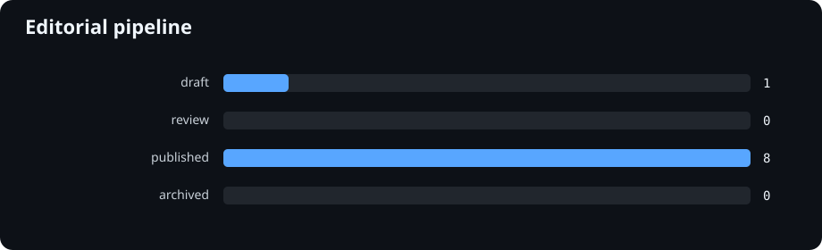
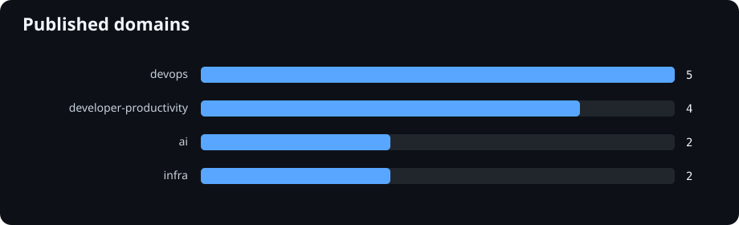
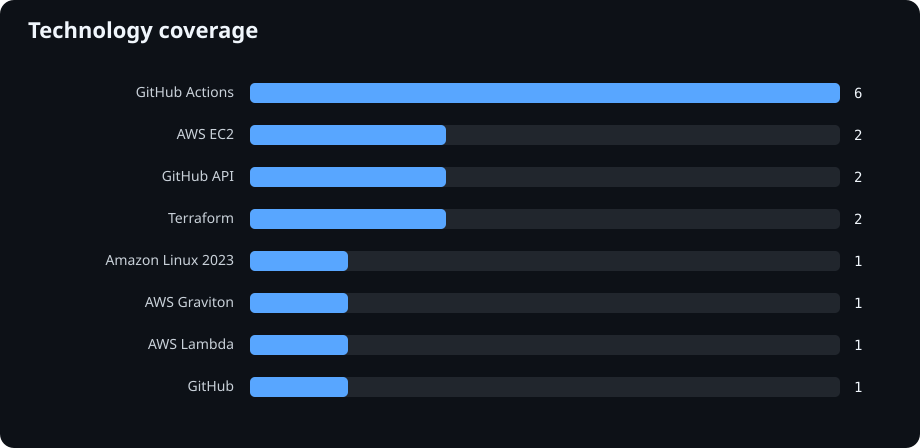
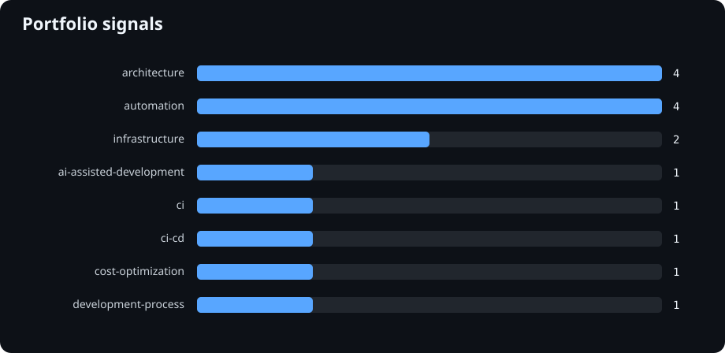
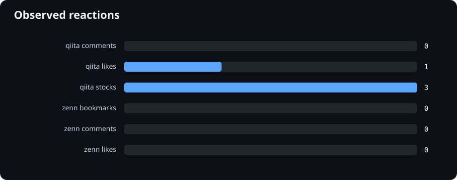

# Writing Analytics — Decision Dashboard

> Analytics as of: 2026-08-28 · Freshness as of: 2026-08-28 · Derived from Repository metadata / publication registry / stored metric snapshots

## まず見る

| 判断軸 | 現在 |
| --- | --- |
| Published | **4** |
| Pipeline | Draft **1** / Review **2** |
| Last published | **2026-08-27** |
| Source freshness | Initial verification **4** / Verified **0** |
| Metric snapshots | **2** / observed span **1d** |
| Data Quality | **3件 — 下のData Qualityを確認** |
| Pipeline-only coverage gaps | **6** |
| 次の記事候補 | [技術記事とは別に、エンジニアとして考えていることを書く場所を作ることにした](../articles/260827-engineer-thinking-place/article.md) (`draft`) |

### 今の判断

- Published記事 **4件** はinitial verification未記録です。過去の確認日は推測せず、次回実確認時に `verified_at` を記録します。
- 7日Trendはまだ待機中です。現在の実snapshot spanは **1日** で、補間はしません。
- Data Quality findingが **3件** あります。記事追加より先に、必要ならmetadata整備対象として確認できます。
- 次記事候補の主な根拠: `communication`

## Editorial Pipeline

## Coverage Gaps

draft / reviewにはあるが、公開済みPortfolioではまだ示せていないclassificationです。

- **topics:** `ci`, `engineering`, `github-actions`, `OSS`, `writing`
- **portfolio_signals:** `communication`

## Source Freshness

> Freshness as of: **2026-08-28**

技術的事実を最後に再確認した記録です。未記録の記事へ過去日付を推測して補完しません。現段階では任意のstale thresholdも置かず、initial verificationと経過日数をそのまま表示します。

| Article | Status | Verified at | Age | Commit refs |
| --- | --- | --- | ---: | ---: |
| [AI開発エージェントを「Repository is the Source of Truth」で動かしたら個人開発がかなり変わった話](../articles/repository-is-source-of-truth/article.md) | Needs initial verification | - | - | 0 |
| [GitHubプロフィールREADMEに「今日の開発活動」を自動表示してみた](../articles/github-profile-daily-activity/article.md) | Needs initial verification | - | - | 0 |
| [GitHubプロフィールをライブな開発ダッシュボードにしてみた](../articles/github-profile-live-dashboard/article.md) | Needs initial verification | - | - | 0 |
| [生成AIをAPI呼び出しで終わらせない — Secret・Quota・Kill Switchを分けるAI Runtime設計](../articles/ai-runtime-safety-boundary.md) | Needs initial verification | - | - | 0 |

## Portfolio Coverage

全classificationの詳細表は [Content Opportunities](./content-opportunities.md) に委譲し、ここでは分布だけを確認します。

### Domains

### Technologies

### Portfolio Signals

## Reactions

reaction chartはlikes / stocks / bookmarks / commentsのみを描画します。page viewsはData Martの観測値として保持します。`0` / `unavailable` / field missingは別状態で、単一のPopularity Scoreには集約しません。

| Article | Platform | Reactions / observed metrics |
| --- | --- | --- |
| [生成AIをAPI呼び出しで終わらせない — Secret・Quota・Kill Switchを分けるAI Runtime設計](https://zenn.dev/mizzz-ivr/articles/ai-runtime-safety-boundary) | zenn | likes 1 · bookmarks 0 · comments 0 · page_views unavailable |
| [GitHubプロフィールREADMEに「今日の開発活動」を自動表示してみた](https://qiita.com/mizzz-ivr/items/73bd3a3874aa8adacc1a) | qiita | likes 0 · stocks 2 · comments 0 · page_views 156 |
| [GitHubプロフィールをライブな開発ダッシュボードにしてみた](https://qiita.com/mizzz-ivr/items/b5cc51f17c9d9e69f630) | qiita | likes 0 · stocks 0 · comments 0 · page_views 158 |
| [AI開発エージェントを「Repository is the Source of Truth」で動かしたら個人開発がかなり変わった話](https://qiita.com/mizzz-ivr/items/44cd3077d732eea1bf6e) | qiita | likes 0 · stocks 0 · comments 0 · page_views 343 |

## Trend Readiness

- Snapshot count: **2**
- First snapshot: **2026-08-27**
- Latest snapshot: **2026-08-28**
- Observed span: **1 days**

| Window | Status |
| --- | --- |
| 7d | **Waiting** |
| 30d | **Waiting** |
| 90d | **Waiting** |

履歴不足時は推測・直線補間・synthetic historyを作りません。

## Data Quality

- `ai-runtime-safety-boundary`: `domains` が未分類
- `ai-runtime-safety-boundary`: `languages` が未分類
- `ai-runtime-safety-boundary`: `technologies` が未分類

## Analysis Data

- [Normalized Writing Analytics Data Mart](../data/analytics/writing-analytics.json) — 集計・分析用の共通derived JSON
- [Public Writing Portfolio JSON](../data/exports/writing-portfolio.json) — 外部公開向けstable schema
- [Writing Profile](./writing-profile.md) — 詳細テキスト分析
- [Content Opportunities](./content-opportunities.md) — coverage全件・次記事推薦の詳細

## Source of Truth

- Article metadata: `articles/**`
- Platform-native analytics evidence: `metadata/platform-native-analytics.yml`
- Publication registry: `ideas/published.md`
- Raw external metrics: `data/metrics/YYYY-MM-DD.json`
- Data Mart / Dashboard / reports: **derived / regeneratable**
